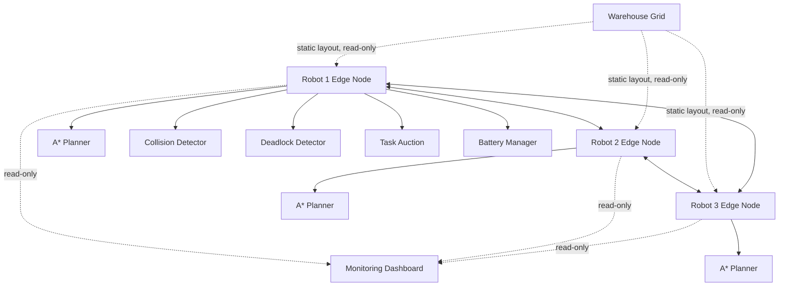

# System Architecture

## Core principle: no centralized movement controller

The dotted arrows into the dashboard are deliberate: they represent a
**read-only** relationship. The dashboard (`dashboard/app.py`) only calls
`Simulator.summary()` / `Simulator.pause()` / `Simulator.resume()` - it
never sets a robot's position, destination, or path. If the Flask
process is killed, the simulator thread driving the robots is completely
unaffected (verified directly - see README section 6).

## Layers

| Layer | Modules | Responsibility |
|---|---|---|
| World model | `simulation/warehouse.py`, `simulation/physics.py` | Static/dynamic grid layout, distance/conflict-predicate math. No decisions. |
| Orchestration | `simulation/simulator.py` | Fixed-timestep loop. Advances robots; makes no movement decisions itself. |
| Edge computing | `robots/robot_controller.py` | The actual "brain": localization, sensing, planning, conflict resolution, deadlock detection, task bidding, battery/charging - one independent instance per robot. |
| Planning | `planning/astar.py`, `reservation_table.py`, `multi_agent_planner.py`, `conflict_detector.py`, `rerouting.py` | Time-aware A* + reservation bookkeeping + conflict classification. |
| Coordination | `coordination/priority.py`, `wait_for_graph.py`, `deadlock.py`, `conflict_resolution.py`, `negotiation.py` | Deterministic priority scoring, cycle detection, who-yields decisions. |
| Communication | `communication/message.py`, `protocol.py`, `peer.py`, `discovery.py`, `network_manager.py` | Real UDP sockets, one per robot, with HMAC-signed messages. |
| Tasks | `tasks/task.py`, `task_manager.py`, `auction.py`, `task_reassignment.py` | Decentralized auction-based allocation; every robot computes the same winner independently from broadcast bids. |
| Monitoring | `dashboard/`, `metrics/` | Read-only observers. Never part of the decision loop. |
| Experiments | `experiments/baseline.py`, `scenarios.py`, `benchmark.py`, `charts.py` | Stop-and-wait baseline + scenario library + comparison harness. |

## Why this is genuinely decentralized (not just "distributed-looking")

Every `Robot` instance owns its own `RobotController`, which owns its own
`NetworkManager` bound to its own UDP socket, its own `ReservationTable`,
its own `LocalWorldModel`. Nothing is shared Python state between robots
except (a) the `Warehouse` object (read-only static layout - the
simulation-convenience exception documented in `robots/robot.py`) and (b)
for convenience in this single-process simulation, a shared `TaskManager`
object whose *methods* are still called independently by each robot based
only on messages it has received - no robot is a designated "auctioneer."

## Known scaling limitation

The priority-based backoff mechanism (`RobotController._check_deadlock`)
resolves 3-robot conflicts in the shipped default warehouse reliably (see
`README.md` section 6 and `experiments/scenarios.py`'s `simple` /
`overlapping_paths` scenarios, both verified zero-collision). Denser
configurations (5+ robots, or robots deliberately spawned very close
together as in the `intersection` scenario) can produce **livelock**
(repeated backoff without progress) or, in one observed adversarial
configuration, take far longer than a full centralized MAPF solver would.
This is a known, disclosed characteristic of priority-based decentralized
planners in the research literature, not a silently-hidden bug. See
`docs/experiment_results.md` for the actual measured numbers and
`README.md`'s "Known Limitations" section for the full discussion and
suggested future work (e.g. token-passing or auction-based intersection
reservation instead of pure priority backoff).
